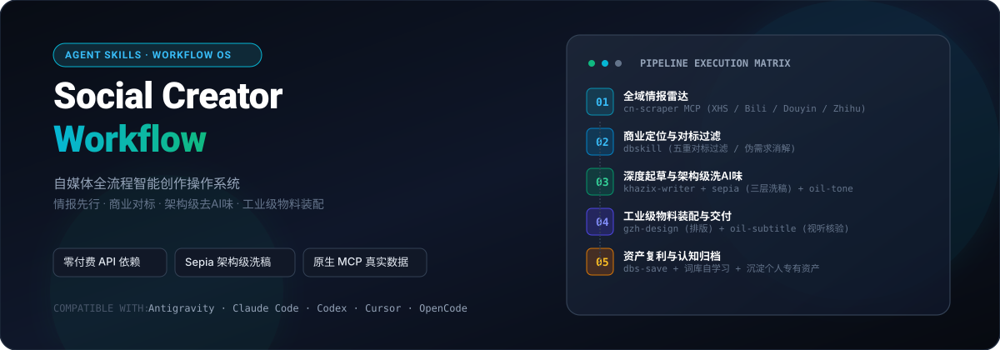

<p align="center">
  
</p>

<p align="center">
  <a href="https://github.com/Tyleraltight/social-creator-workflow/blob/main/LICENSE"></a>
  <a href="https://agentskills.io"></a>
  <a href="https://github.com/Tyleraltight/social-creator-workflow"></a>
  <a href="https://github.com/Tyleraltight/social-creator-workflow"></a>
</p>

---

## 价值主张

面向微信公众号、小红书、B站、短视频等全域自媒体的**工业级闭环智能创作操作系统**。

传统 AI 创作的最大痛点在于“凭空编造虚假痛点”与“浓烈且工整的 AI 机器味”。本项目严格贯彻 **「真实情报先行 ➔ 商业对标过滤 ➔ 深度起草 ➔ 架构级洗 AI 味 ➔ 工业级物料装配 ➔ 资产复利」** 的五阶全闭环标准，交付即是可发布的成品。

---

## 核心五阶执行架构

| 阶段 | 核心任务 | 底层驱动工具 | 关键交付物 |
| :--- | :--- | :--- | :--- |
| **01. 全域情报雷达** | 抓取平台实时爆款、高频热评与争议焦点，拒绝凭空臆想 | 本地原生 `cn-scraper` MCP (小红书 / B站 / 抖音 / 知乎 / 微博) | 《受众痛点与争议事实清单》 |
| **02. 商业对标过滤** | 5 重商业化对标过滤，消解伪需求，明确转化路径 | `dbskill` 核心矩阵 (`dbs-benchmark`, `dbs-diagnosis`, `dbs-deconstruct`) | 《单篇定位承诺与受众画像》 |
| **03. 深度起草与洗稿** | 人味叙事起草 + 三层架构级洗 AI 味 + 事实边界审查 | `khazix-writer` + `sepia` (三层洗稿重构) + `oil-tone` (`tone_lint.py`) | 零机器味、零鸡汤升华的终审文稿 |
| **04. 工业级物料装配** | 格式自校验图文排版、实操抽帧封面、2.5D 代码运镜与视听校对字幕 | `gzh-design` + `oil-cover` + `video-shotcraft` + `oil-subtitle` | 带一键复制的 HTML / 4:3 封面 / 电影级压制视频 |
| **05. 资产复利沉淀** | 方法论与决策归档，术语自学习错题本沉淀 | `dbs-save` + `dbs-decision` + 本地词库引擎 | 个人专属创作经验库与专业词典 |

---

## 阶段 3 核心亮点：Sepia 架构级洗 AI 味引擎

市面上浅层的 Humanizer 工具仅停留在词汇替换层面，而前沿学术实测表明 **AI 检测器仅凭“叙事架构特征”就能以 93.2% 的准确率识破机器文本**。

本工作流将 `sepia` 深度嵌入内容生产流水线，实施**三层穿透式重构**：

```text
[初始起草] ──> [sepia-review 诊断扫描] ──> [sepia-refactor / recreate 三层重构] ──> [oil-tone 事实硬查杀]
```

1. **Pass 1 叙事架构层**：
   - 彻底砍掉末尾“总的来说 / 这带给我们的启示……”等抽象鸡汤与自我和解式总结。
   - 强制植入至少 1 处真实发生过的“翻车试验、踩坑经过或无效路径”。
   - 松开机械单线的因果推导，延迟结论释放。
2. **Pass 2 篇章推进层**：
   - 打碎“一段提问接一段解答”的工整结构，重构自然对话与故事叙述的呼吸节奏。
3. **Pass 3 句法语调层**：
   - 针对中文语料（基于 HC3 规范校准）打破节拍器式的句子对称，同一段落内有意识拉大短句与长句的长度落差。

---

## 快速调用指南

本工作流已封装为标准 Agent Skill。在已支持 Agent Skills 的运行时环境中，输入自然语言即可一键调度：

### 1. 全流程端到端执行
```text
运行 social-creator-flow：我想做 [具体选题/关键词]，先搜小红书和B站近期的真实数据，再帮我定策略并出稿。
```

### 2. 专项深度去 AI 味洗稿
```text
用 sepia-recreate 帮我洗一下这段文案，打破因果套路和拔高结尾，重写成有活人感的稿子，最后用 oil-tone 校验事实边界。
```

### 3. 公众号长文全套闭环
```text
针对 [行业痛点]，用卡兹克风格写一篇深度长文，经 sepia 架构级洗稿后，直接用 gzh-design 摸鱼绿主题排版输出带一键复制的 HTML。
```

### 4. 视频字幕与封面流水线
```text
给 [视频路径] 走本地字幕流水线：用 oil-subtitle 进行视觉抽帧核对与烧录，并用 oil-cover 输出 3:4 封面。
```

---

## 本地安装

```bash
# 克隆本仓库到工作区
git clone https://github.com/Tyleraltight/social-creator-workflow.git

# 或者通过 skills CLI 添加
npx skills add Tyleraltight/social-creator-workflow
```

---

## 许可证
MIT License © 2026 Tyler / T
